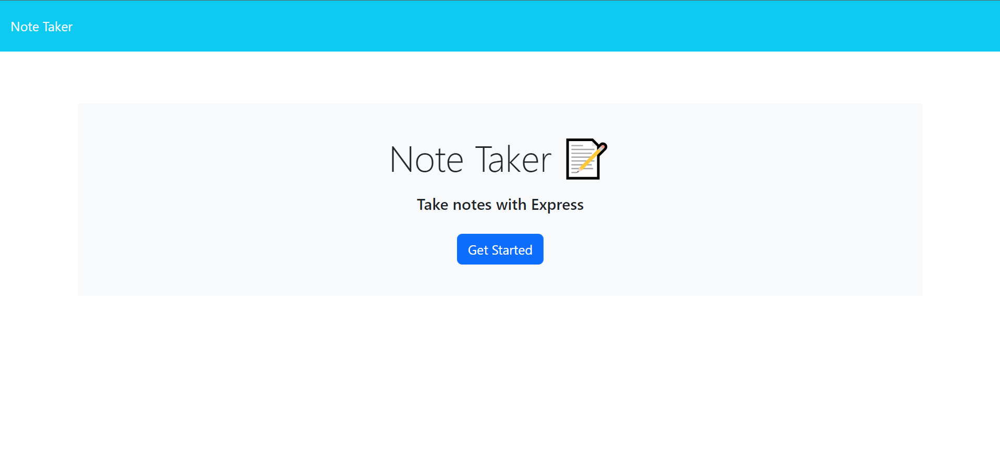
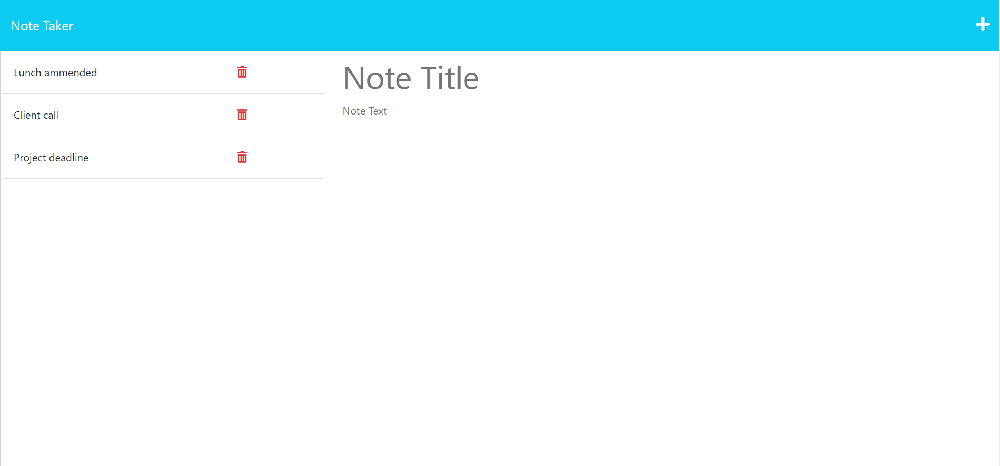
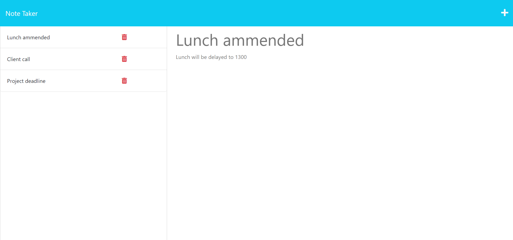

# SVG Logo Maker

## License

[Description](#description) 
[Usage](#usage) 
[Features](#features) 
[Installation](#installation) 
[Tests](#tests) 
[Deployment](#deployment) 
[Credits](#credits) 

## Description
A simple note-taking application built with Node.js and Express. Users can create and save notes, view existing notes, and delete notes they no longer need.

## Usage
This application allows for easy note taking, reading and deleting.

## Features
* Creating notes.
* Deleting notes.
* Viewing a list of created notes.
* Command line comments/color highlights when different routes are used.

## Deployment
* The application is deployed live through Heroku [here](https://note-generator.herokuapp.com/).
* The source code can be found [here](https://github.com/darylbg/note-taker).
* The deployed app will look similar to the following screenshots

## Credits
This application was made by Daryl Blough.

My github is [darylbg](https://github.com/darylbg) .

For any questions or input please use my email daryl123@gmail.com.